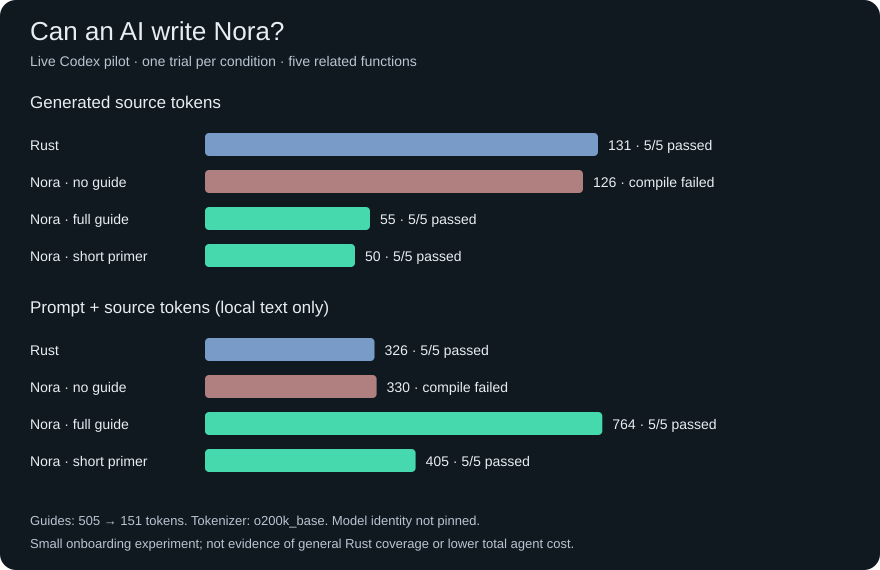

# Nora

**Ugly syntax. Precise Rust. Fewer tokens.**

An experimental AI-native coding language written in Rust. Nora explores a compact
representation that AI agents can learn from a short reference and compile into
ordinary Rust. Human readability is optional. Preserving program meaning is not.

```text
offset(x,delta:i)=x+delta
total(q,price,discount:i)=q*price-discount
label(a,b:i)=$(a+b)
```

[Try it](#try-it) · [AI reference](docs/ai-reference.md) · [Benchmarks](#measured-results) · [v0.1.0 release](https://github.com/dominikpeter/nora/releases/tag/v0.1.0)

> **Early experiment.** Full compact Rust coverage is the goal. Today, compact
> functions support integers, strings, and arithmetic; other Rust features use
> verbatim passthrough. AI readiness is measured, not assumed.

## Measured results



We ran four fresh Codex CLI sessions on the same five-function task, then
compiled and executed the answers against external behavioral checks. No repairs
or tool use occurred in these trials.

| Condition | Result | Source tokens | Local prompt tokens |
| --- | --- | ---: | ---: |
| Rust | 5/5 checks passed | 131 | 195 |
| Nora without a guide | Failed to compile | 126 | 204 |
| Nora with the full AI reference | 5/5 checks passed | 55 | 709 |
| Nora with the short primer | 5/5 checks passed | 50 | 355 |

**The short primer used 70% fewer instruction tokens (151 vs. 505)** and the model
still passed all five checks. Its 50 source tokens were **62% fewer than Rust's
131**. Neither guided answer used Rust passthrough. Without a guide, the model
guessed invalid syntax.

Prompt plus source decreased from **764 with the full guide to 405 with the
primer**, but Rust still used fewer at **326**. These are small onboarding
results, not evidence of lower total agent cost.

The CLI reported the following usage, including its system context:

| Condition | Input tokens | Cached input (subset) | Output tokens | Reasoning output (subset) |
| --- | ---: | ---: | ---: | ---: |
| Rust | 19,445 | 12,288 | 135 | 0 |
| Nora without a guide | 19,454 | 12,288 | 604 | 472 |
| Nora with the full guide | 19,961 | 12,288 | 59 | 0 |
| Nora with the short primer | 19,619 | 12,288 | 54 | 0 |

Source and local prompt counts use `o200k_base`; API usage comes from CLI events.
One trial per condition, five small related functions, Codex CLI 0.158.0 with its
default model (identity not pinned). Tasks overlap concepts taught by the guide.
These results do not establish generalization, statistical reliability, or 100%
AI correctness. [Initial report](benchmarks/ai-guide/results/initial/) · [Primer report](benchmarks/ai-guide/results/primer/)
· [Method and reproduction](benchmarks/ai-guide/README.md).

## Try it

Requires Git and a recent stable Rust toolchain with edition 2024 support.
Install Rust using [rustup](https://www.rust-lang.org/tools/install) if needed.
Nora itself has no third-party Rust dependencies.

```sh
git clone https://github.com/dominikpeter/nora.git
cd nora
cargo install --path .
mkdir -p target/demo
nora examples/compact.nora > target/demo/compact.rs
rustc --edition=2024 target/demo/compact.rs -o target/demo/compact
./target/demo/compact
```

Output: `6`. Ensure Cargo's binary directory (normally `~/.cargo/bin`) is on
`PATH`. Without installing Nora, replace `nora` with `cargo run --quiet --`.
The commands above use Unix paths; Windows executables end in `.exe`.

With [just](https://github.com/casey/just) installed:

```sh
just demo          # compile and execute the example
just ai            # print the reference to give an AI
just check         # offline tests, lint, and benchmark fixtures
just bench         # five Rust/Nora compatibility cases
just setup-tokens  # optional tokenizer environment
just tokens        # source syntax comparison
just bench-ai      # THREE LIVE MODEL CALLS; requires authenticated Codex
just graphs        # regenerate graph from committed pilot results
```

Run `just` for all recipes. The current main branch includes the AI guide and
live benchmark added after v0.1.0. For the original release, check out `v0.1.0`.

## Give an AI a precise contract

Run `just ai` and supply its output with the task. The 151-token [primer](docs/ai-primer.md) teaches implemented syntax with examples
and a Rust fallback. Load the [full reference](docs/ai-reference.md) only when
you need repair details. [AGENTS.md](AGENTS.md) guides agents working on Nora
itself. Include reference tokens when measuring a model's cost.

The compiler embeds the guide, so it is available outside the repository:

```sh
nora --ai-reference       # display the short primer
nora --ai-reference-full  # full grammar and repair reference
nora --prompt task.txt    # emit the guide followed by your task
```

To inject it into a Codex CLI request:

```sh
nora --prompt task.txt > prompt.txt
codex exec - < prompt.txt
```

This last command makes a real model call. The guide is ordinary prompt text,
not a change to model weights. For API use, supply the reference as an instruction
message and the task as user input. `just prompt task.txt` works from a checkout.
The installed CLI must be rebuilt from current main for these post-v0.1.0 flags.

```text
Nora → parsing + type checking → Rust → rustc → native code
```

Compilation is deterministic and needs no AI model. Rust handles native code
generation. For model development, correctness is the gate; token count selects
among representations that preserve it.

## Small syntax, explicit meaning

| Nora | Meaning |
| --- | --- |
| `i` / `s` | Rust `i64` / owned `String` |
| `add(a,b:i)=a+b` | Two integer parameters; inferred integer return |
| `text(x:i)=$x` | Integer-to-string conversion |
| `label(a,b:i)=$(a+b)` | Convert the sum, not one operand |
| `identity(x:s)=x` | Move the string into the return value |
| `text(x:i)->s=str(x)` | Equivalent explicit spelling |

For `text(x:i)=$x`, Nora emits:

```rust
pub fn nora_text(v_x: i64) -> String {
    (v_x).to_string()
}
```

Generated functions use `nora_`; parameters use `v_` to avoid Rust keyword
collisions. Function-only output is library source: compile with
`rustc --edition=2024 --crate-type lib file.rs`.
[Full syntax and limitations](docs/language.md).

## Keep Rust available

A line containing `%%rust` switches the remainder of the file to verbatim Rust:

```text
double(x:i)=x*2
%%rust
fn main() {
    assert_eq!(nora_double(3), 6);
}
```

There is no closing delimiter. `.rs` files also pass through unchanged. Rust
sections support ordinary Rust; compact expressions cannot yet call arbitrary
Rust functions. Cargo still manages dependencies and build scripts. Nora does
not yet implement a full Rust grammar or diagnostic source mapping.

## A testable project

The Programming Rust suite covers GCD, FIFO queues, generic ownership, interval
ordering, and a compact data transformation. All five Rust references and five
Nora fixtures pass. **Four Nora fixtures use Rust passthrough; only one uses
compact Nora.** This is compatibility coverage, not model performance.

```sh
just check
# Equivalent commands:
cargo test
cargo fmt --check
cargo clippy --all-targets -- -D warnings
python3 -m unittest discover -s scripts -p 'test_*.py'
python3 scripts/bench_smoke.py
```

Evaluator tests reject wrong arithmetic, broken FIFO ordering, wrong interval
ordering, invalid source, disabled tests, and infinite loops. Reports go under
`target/`. [Benchmark instructions and upstream licenses](benchmarks/programming-rust/README.md).

Live model runs execute generated native code locally; use an isolated disposable
environment for untrusted outputs. Temporary directories are not a sandbox.

## Iterate toward the goal

1. Add a Rust behavior and independent correctness checks.
2. Design compact syntax with deterministic expansion.
3. Search spelling candidates using real tokenizer counts on complete programs.
4. Freeze the guide/profile before testing unseen tasks and model trials.
5. Keep improvements only when correctness holds and total coding cost improves.

The original five syntax examples measured **89 Rust → 49 original Nora → 41
compact Nora tokens** on both `o200k_base` and `cl100k_base`. Reproduce with
`just setup-tokens && just tokens`. These are source-only measurements.

Compiler: `src/lib.rs`. CLI: `src/main.rs`. Tests: `tests/` and `scripts/test_*.py`.
Library API: `nora::compile(&str) -> Result<String, String>`.

## References

- [Programming Rust examples](https://github.com/ProgrammingRust/examples): pinned, licensed benchmark references.
- [Gleam compiler and tests](https://github.com/gleam-lang/gleam/tree/main/test): a reference for compiler test organization; no Gleam code imported.
- [Build a Compiler from Scratch](https://blog.sylver.dev/build-a-compiler-from-scratch-part-0-introduction): iterative compiler construction.
- [Dan Luu's experiments](https://danluu.com/pl-tokens/): why source brevity does not establish lower agent cost.
- [Cython](https://github.com/cython/cython), [Pythran](https://pythran.readthedocs.io/en/latest/), [mypyc](https://mypyc.readthedocs.io/en/latest/): compilation and interoperability references.
